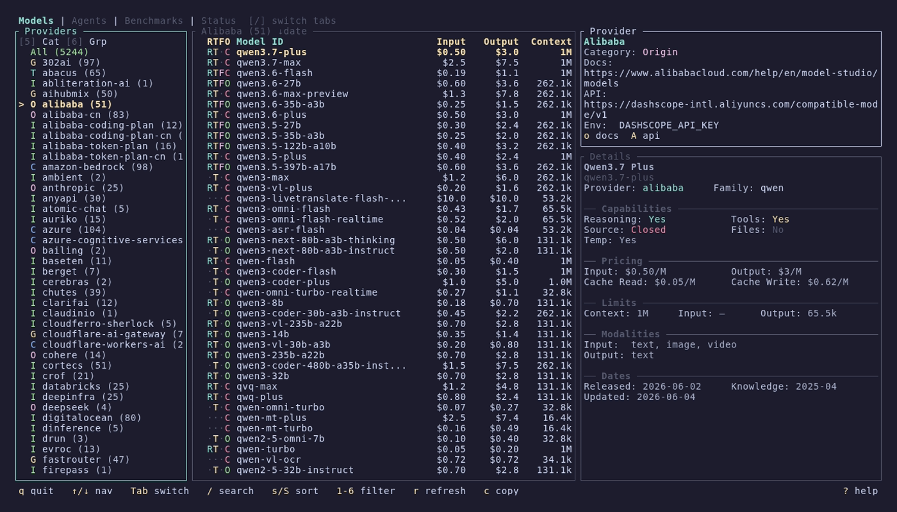
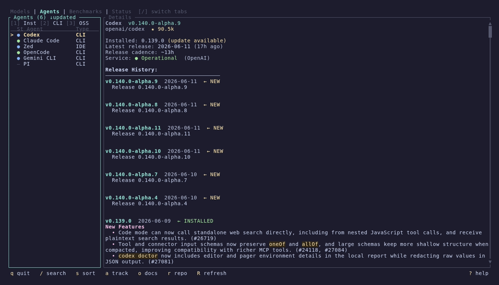
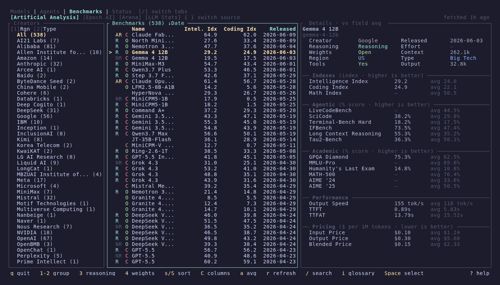
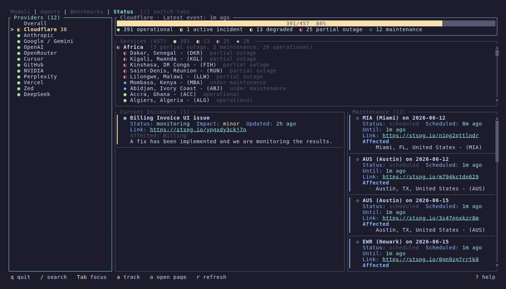

<p align="center">
  
</p>

<p align="center">
  <a href="https://crates.io/crates/modelsdev"></a>
  <a href="https://github.com/reyamira/models/actions/workflows/update-benchmarks.yml"></a>
  <a href="https://opensource.org/licenses/MIT"></a>
  <a href="https://buymeacoffee.com/arimxyer"></a>
</p>

TUI and CLI for browsing AI models, benchmarks, coding agents, and provider statuses.



## Highlights

- **~4,000+ models** across 85+ providers from [models.dev](https://models.dev) — filter by capability, price, context, and provider category
- **~1,000 benchmark entries** across 4 data sources — [Artificial Analysis](https://artificialanalysis.ai), [Epoch AI](https://epoch.ai), [Arena](https://arena.ai), and [LLM Stats](https://llm-stats.com) — compare models head-to-head with scatter plots and radar charts
- **12+ coding agents** tracked with version detection, changelogs, and GitHub integration
- **22 provider statuses** monitored live across 7 status page platforms

## What's New in v0.13.0

- **Add agents in-app** — press `A` to add a custom coding agent by name + `owner/repo`; it's tracked and fetched immediately, no config editing.
- **In-app self-updates** — update a tracked agent (`u`), all agents with updates available (`U`), or cancel an in-flight update (`x`), all from the Agents tab. The update command is derived from how each agent was actually installed (bun/npm/brew/cargo/AUR/apt/dnf, etc.), with an interactive suspend-and-run mode (`i`) for updaters that need a prompt or sudo.

## What's New in v0.12.1

- **Mouse support** — click a row to select it, click a panel to focus it, click a header tab to switch tabs, and scroll with the wheel. Popups (sort, columns, glossary, trackers, help) scroll and accept row clicks too.

## What's New in v0.12.0

- **Multi-source benchmarks** — 4 switchable data sources (Artificial Analysis, Epoch AI, Arena, LLM Stats) with state-preserving switching, in-app refresh, and a benchmark glossary
- **Column picker** — choose which metric columns are visible, persisted per source in config.toml
- **Comparator column** — cycle field average / peer average / rank alongside every score in the detail panel
- **Refresh keys everywhere** — refresh benchmarks, models.dev data, and agent GitHub data without restarting
- **`default_tab` config** — launch the TUI straight into your tab of choice
- **Prebuilt Nix binaries** — builds are pushed to a public Cachix cache; `nix run` downloads instead of compiling

## Install

### Homebrew (macOS/Linux)
```bash
brew install models
```

### Cargo (any platform)
```bash
cargo install modelsdev
```

### Nix (flake)
```bash
nix run github:reyamira/models
nix profile install github:reyamira/models
```

The flake is available directly from GitHub tags and branches; it is not currently published to FlakeHub or nixpkgs.

### Scoop (Windows)
```powershell
scoop install extras/models
```

### AUR (Arch Linux)
```bash
paru -S models-bin
```

Pre-built binaries, `.deb`, and `.rpm` packages are available on [GitHub Releases](https://github.com/reyamira/models/releases). See the [Installation wiki page](https://github.com/reyamira/models/wiki/Installation) for all methods, shell completions, and command aliases.

## Quick Start

```bash
models
```

<video src="https://github.com/user-attachments/assets/2e205916-5998-42b2-b60e-c8ffd7b2a668" controls width="100%"></video>

Navigate with arrow keys, switch tabs with `[`/`]`, search with `/`, and press `?` for context-aware help. Mouse works too — click a row to select it, click a panel to focus it, and scroll with the wheel. See [Getting Started](https://github.com/reyamira/models/wiki/Getting-Started) for a full walkthrough.

## Features

### Models — browse and compare AI models

Three-column layout with providers, model list, and rich detail panel. RTFO capability indicators, 6 filter keys, sort by name/date/cost/context, cross-provider search, and copy-to-clipboard.

[Models wiki page](https://github.com/reyamira/models/wiki/Models) &#8226; CLI: `models list`, `models show`, `models search`, `models providers`

### Agents — track AI coding assistants



Curated catalog of 12+ agents with automatic version detection, GitHub release tracking, styled changelogs with search and match navigation, and live service health from provider status pages. Add your own agents without leaving the TUI (`A`), and update installed ones in-app (`u` one / `U` all) — the update command is derived from how each tool was actually installed (npm, bun, Homebrew, uv, pipx, or a system package manager like pacman/AUR, apt, dnf).

[Agents wiki page](https://github.com/reyamira/models/wiki/Agents) &#8226; CLI: `agents status`, `agents <tool>`, `agents latest`, `agents list-sources`

### Benchmarks — compare model performance



~1,000 entries across 4 switchable data sources (Artificial Analysis, Epoch AI, Arena, LLM Stats) with quality indexes, Elo ratings, speed, and pricing. Compare mode with head-to-head tables, scatter plots, and radar charts. Choose visible metric columns, cycle a field-average/peer-average/rank comparator in the detail panel, and refresh any source in-app. Filter by creator, region, type, reasoning, and open/closed source.

[Benchmarks wiki page](https://github.com/reyamira/models/wiki/Benchmarks) &#8226; CLI: `models benchmarks list`, `models benchmarks show`

### Status — monitor provider health



Live health monitoring for 22 AI providers across 7 status page platforms. Overall dashboard with health gauge, incident and maintenance cards. Provider detail with grouped services, incidents, and scheduled maintenance.

[Status wiki page](https://github.com/reyamira/models/wiki/Status) &#8226; CLI: `models status list`, `models status show`, `models status status`

## Documentation

Full documentation lives in the [wiki](https://github.com/reyamira/models/wiki):

| Page | Description |
|------|-------------|
| [Installation](https://github.com/reyamira/models/wiki/Installation) | All install methods, shell completions, command aliases |
| [Getting Started](https://github.com/reyamira/models/wiki/Getting-Started) | First launch, navigation, basic usage |
| [Models](https://github.com/reyamira/models/wiki/Models) | Models tab and CLI commands |
| [Agents](https://github.com/reyamira/models/wiki/Agents) | Agents tab and CLI commands |
| [Benchmarks](https://github.com/reyamira/models/wiki/Benchmarks) | Benchmarks tab and CLI commands |
| [Status](https://github.com/reyamira/models/wiki/Status) | Status tab and CLI commands |
| [Configuration](https://github.com/reyamira/models/wiki/Configuration) | Config file, custom agents, tracked providers |
| [Data Sources](https://github.com/reyamira/models/wiki/Data-Sources) | Where the data comes from |
| [Architecture](https://github.com/reyamira/models/wiki/Architecture) | Internal design for contributors |
| [Contributing](https://github.com/reyamira/models/wiki/Contributing) | How to contribute |

## Data Sources

- **Models**: [models.dev](https://models.dev) by [SST](https://github.com/sst/models.dev)
- **Benchmarks**: [Artificial Analysis](https://artificialanalysis.ai), [Epoch AI](https://epoch.ai) (CC-BY), [Arena](https://arena.ai), [LLM Stats](https://llm-stats.com)
- **Agents**: Curated catalog in [`data/agents.json`](data/agents.json) — contributions welcome!
- **Status**: Official provider status pages ([Statuspage](https://www.atlassian.com/software/statuspage), [BetterStack](https://betterstack.com), [Instatus](https://instatus.com), [incident.io](https://incident.io), and more)

## Contributing

Contributions are welcome! Please read the [Contributing Guide](CONTRIBUTING.md) before submitting a PR.

This project follows the [Contributor Covenant Code of Conduct](CODE_OF_CONDUCT.md).

## License

MIT
